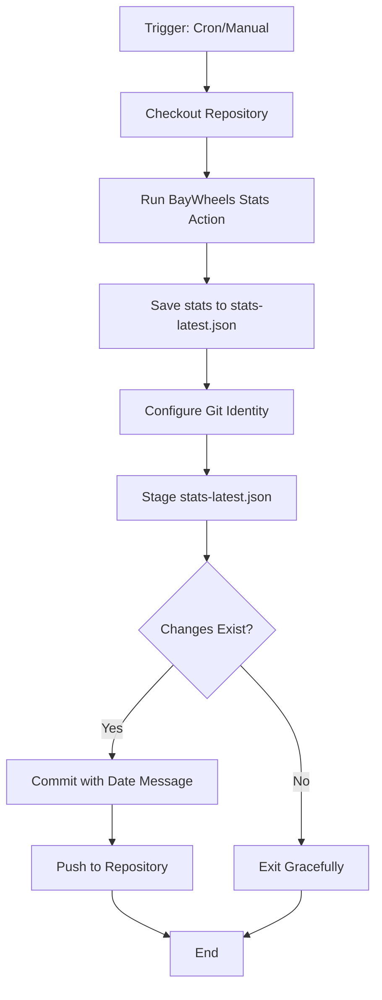

# Design Document

## Overview

This design document outlines the implementation of a GitHub Actions workflow that automatically collects BayWheels statistics daily and commits the results to the repository. The workflow leverages a custom action from the tatimblin/baywheels-stats repository and maintains a single stats file that is overwritten with each run.

## Architecture

The solution consists of a single GitHub Actions workflow file that orchestrates the following operations:

1. Scheduled execution via cron trigger (daily at 3 AM UTC)
2. Manual execution support via workflow_dispatch
3. Repository checkout
4. BayWheels stats collection using external action
5. File writing with stats output
6. Git commit and push operations

### Workflow Diagram



## Components and Interfaces

### Workflow File Structure

**Location:** `.github/workflows/baywheels-stats.yml`

**Triggers:**
- `schedule`: Cron expression `0 3 * * *` for daily execution at 3 AM UTC
- `workflow_dispatch`: Manual trigger with no inputs required

**Job Configuration:**
- **Name:** `collect-stats`
- **Runner:** `ubuntu-latest`
- **Permissions:** Requires `contents: write` permission to commit and push changes

### Workflow Steps

#### Step 1: Checkout Repository
- **Action:** `actions/checkout@v4`
- **Purpose:** Clone the repository to the runner workspace
- **Configuration:** Default settings

#### Step 2: Query BayWheels Stats
- **Action:** `tatimblin/baywheels-stats@main`
- **ID:** `baywheels` (for referencing outputs)
- **Configuration:**
  - `refresh_session: 'true'` - Enable session refresh
  - `secrets: inherit` - Pass all repository secrets to the action
- **Outputs:**
  - `stats`: Complete JSON statistics object

#### Step 3: Save Stats to File
- **Type:** Shell command
- **Command:** Write the stats output to `bike-stats.json`
- **Implementation:** Use echo with output redirection to overwrite the file

#### Step 4: Commit and Push Stats
- **Type:** Shell script
- **Operations:**
  1. Configure git user identity as github-actions bot
  2. Stage the stats-latest.json file
  3. Create commit with descriptive message including date
  4. Handle no-changes scenario gracefully with `|| exit 0`
  5. Push changes to the repository

## Data Models

### Stats Output Format

The BayWheels stats action outputs JSON data with the following structure (based on the action's documented outputs):

```json
{
  "number_of_rides": <integer>,
  "total_minutes": <integer>,
  "total_distance": <integer>
}
```

The complete stats object is saved as-is to `stats-latest.json` without transformation.

### File Output

**Filename:** `stats-latest.json`
**Location:** Repository root
**Format:** JSON
**Update Strategy:** Overwrite on each run
**Content:** Raw output from the BayWheels stats action

## Error Handling

### Workflow-Level Error Handling

1. **Action Failure:** If the BayWheels stats action fails, the workflow will fail and no commit will be made
2. **No Changes:** If the stats haven't changed since the last run, the commit command will exit gracefully without error using `|| exit 0`
3. **Git Push Failure:** If the push fails (e.g., due to conflicts), the workflow will fail and can be retried manually

### Permissions

The workflow requires the following permissions:
- `contents: write` - To commit and push changes to the repository

This permission must be granted either:
- At the repository level (Settings > Actions > General > Workflow permissions)
- Or explicitly in the workflow file using the `permissions` key

## Testing Strategy

### Manual Testing

1. **Workflow Dispatch Test:**
   - Trigger the workflow manually via GitHub Actions UI
   - Verify the workflow completes successfully
   - Check that stats-latest.json is created/updated
   - Verify the commit message includes the current date
   - Confirm the changes are pushed to the repository

2. **Scheduled Execution Test:**
   - Wait for the scheduled run at 3 AM UTC
   - Verify the workflow executes automatically
   - Check the workflow run logs for any errors
   - Confirm the stats file is updated

3. **No-Changes Scenario Test:**
   - Run the workflow twice in quick succession
   - Verify the second run exits gracefully when no changes exist
   - Confirm no duplicate commits are created

### Validation Checks

1. **File Format Validation:**
   - Verify stats-latest.json contains valid JSON
   - Check that the file structure matches expected output

2. **Git History Validation:**
   - Verify commits are attributed to github-actions bot
   - Check commit messages follow the expected format
   - Confirm only stats-latest.json is included in commits

3. **Action Integration Validation:**
   - Verify the tatimblin/baywheels-stats action is called correctly
   - Confirm secrets are passed properly
   - Check that the stats output is captured correctly

## Implementation Notes

### Workflow File Naming

The workflow file will be named `baywheels-stats.yml` to clearly indicate its purpose and distinguish it from the existing `vue.yml` deployment workflow.

### Git Configuration

The workflow uses the standard github-actions bot identity:
- **Name:** `github-actions[bot]`
- **Email:** `github-actions[bot]@users.noreply.github.com`

This ensures commits are clearly identified as automated.

### Cron Schedule

The cron expression `0 3 * * *` runs the workflow daily at 3:00 AM UTC. This timing:
- Avoids peak usage hours
- Ensures fresh daily statistics
- Minimizes impact on other workflows

### Action Version Pinning

The design uses `@main` for the BayWheels stats action as shown in the provided example. For production use, consider:
- Pinning to a specific version tag for stability
- Or accepting the risk of breaking changes with `@main` for automatic updates
