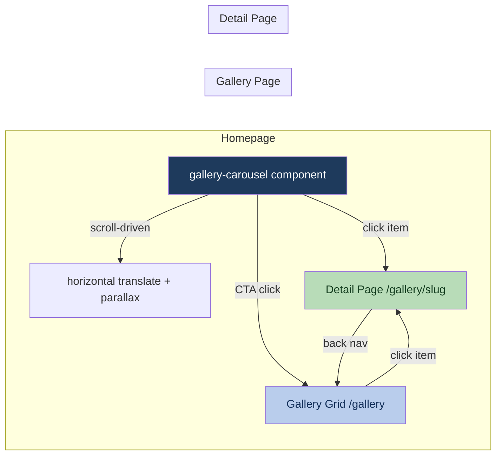

# feat: Add gallery experience with scroll-driven carousel, grid, and detail pages

## Summary

Build a personal photo/video gallery with three connected surfaces: a scroll-driven horizontal carousel on the homepage, a dedicated masonry-style grid page at `/gallery`, and per-item detail pages at `/gallery/[slug]`. All page transitions use Astro's View Transitions API so thumbnails morph into their full-size counterparts across navigations.

---

## Problem Frame

The site currently has no visual media presence. The gallery adds a personal photo/video layer that visitors encounter first (above Section One), with deeper browsing available on a dedicated page. The scroll-driven carousel ties into the site's existing scroll-animation identity rather than adding a foreign interaction pattern.

---

## Requirements

- **R1.** Homepage carousel translates horizontally as the user scrolls vertically, with images parallaxing within their frames
- **R2.** Carousel items are clickable → navigate to detail page with view transition morph
- **R3.** CTA at the trailing end of the carousel links to `/gallery`
- **R4.** Gallery grid page shows all media in uniform-width columns with natural aspect ratios (masonry height)
- **R5.** Grid is responsive: 3 columns on mobile, scaling up on wider viewports
- **R6.** Grid items clickable → navigate to detail page with view transition morph
- **R7.** Detail page shows full media, caption, and date
- **R8.** Back navigation from detail returns to gallery with reverse view transition
- **R9.** All transitions use Astro's built-in View Transitions (MPA mode)
- **R10.** Scroll-driven carousel degrades gracefully where `animation-timeline: scroll()` is unsupported
- **R11.** Respect `prefers-reduced-motion` — disable parallax and reduce transitions
- **R12.** No JS frameworks — Astro + vanilla web components only
- **R13.** Content is local static assets with metadata (caption, date, file reference)
- **R14.** Videos show poster frame in grid/carousel; play only in detail view

---

## Key Technical Decisions

**Content Collections over raw JSON manifest.** Astro 6's content collections with a `gallery` collection gives type-safe access to metadata, automatic slug generation, and `getCollection()` / `getEntry()` APIs. Each item is a markdown/yaml file with frontmatter (caption, date, media path, type). This avoids a custom JSON loader and integrates with Astro's build pipeline.

**View Transitions via `<ClientRouter />`.** Astro 6 renamed `<ViewTransitions />` to `<ClientRouter />` in the `astro:transitions` module. Adding it to Layout.astro enables MPA view transitions site-wide. Per-item `transition:name` directives on thumbnails and detail media create the morph effect.

**CSS `column-count` for the masonry grid.** CSS multi-column layout provides uniform column widths with natural height variation natively. No JS needed. `column-count` scales responsively via media queries. This is simpler than CSS Grid + `masonry` (still experimental) and avoids JS masonry libraries.

**Carousel as a web component (`@whois/gallery-carousel`).** Follows the existing `@whois/sticky-heading` and `@whois/wobble-text` pattern — a custom element in `packages/gallery-carousel/` with its own styles. The component handles scroll-driven horizontal translation and inner parallax using `animation-timeline: scroll()`.

**URL structure: `/gallery` + `/gallery/[slug]`.** Slugs derived from content collection entry IDs (filename without extension). Human-readable, stable, good for sharing.

**Poster frames for video.** Videos display a static poster in grid/carousel (via the `poster` attribute on `<video>`). Autoplay muted only triggers on the detail page. This keeps the grid performant and avoids unexpected audio/motion.

**Procedural cloud backgrounds via `/procedural-clouds` skill.** The existing `@whois/cloud-scene` package already uses Three.js. The gallery pages can use the procedural-clouds skill's rendering paths (mesh cluster for desktop, billboard for mobile) to add atmospheric cloud backgrounds behind the grid and detail views — consistent with the homepage's cloud-scene identity. Use the skill during implementation to configure cloud presets (e.g., `highCirrus` or `clearDay`) and time-of-day lighting for visual continuity across the site.

---

## High-Level Technical Design



**View Transition flow:**
```
Thumbnail (transition:name="gallery-{slug}")
    ↕ morph
Full media (transition:name="gallery-{slug}")
```

The same `transition:name` is applied to the thumbnail element in both the carousel and grid, and to the full-size media element on the detail page. Astro's client router matches these names across navigations to produce the morph animation.

**Scroll-driven carousel mechanics:**
```
vertical scroll progress (0% → 100%)
    → horizontal translateX of carousel track (0 → -(totalWidth - viewportWidth))
    → per-item parallax: image translateX offset relative to its frame
```

The carousel container has a tall explicit height (e.g., `300vh`) to create scroll runway. The inner track uses `animation-timeline: scroll(nearest)` with a `translateX` keyframe. Each image within its frame uses a separate parallax animation at a slower rate.

---

## Scope Boundaries

### In Scope

- Content collection setup with sample entries
- Homepage carousel component and integration
- Gallery grid page
- Detail page with back navigation
- View Transitions configuration
- Responsive layout and reduced-motion handling
- Graceful degradation for unsupported scroll-timeline

### Deferred to Follow-Up Work

- Image optimization pipeline (Astro `<Image>` with responsive srcset) — use standard `` tags initially
- Infinite scroll or pagination on the grid page
- Filtering/tagging on the grid
- Admin interface for managing gallery content
- Video transcoding or format optimization

---

## Open Questions

- **Carousel scroll height:** How tall should the carousel section be (determines how much vertical scroll drives the horizontal motion)? Starting with `300vh` and adjusting based on item count.
- **Transition fallback:** On browsers without View Transitions support, Astro falls back to instant navigation — acceptable as progressive enhancement.

---

## Implementation Units

### U1. Content Collection Setup

**Goal:** Establish the data layer for gallery items.

**Requirements:** R13, R14

**Dependencies:** None

**Files:**
- `src/content.config.ts` (create or extend)
- `src/content/gallery/` (create directory)
- `src/content/gallery/sample-1.yaml` (sample entry)
- `src/content/gallery/sample-2.yaml` (sample entry)
- `src/content/gallery/sample-3.yaml` (sample entry)
- `public/gallery/` (media files directory)

**Approach:** Define a `gallery` collection in Astro's content config. Each entry is a YAML file with fields: `title` (caption), `date`, `media` (path to file in `public/gallery/`), `type` (image | video), `poster` (optional, for video poster frames), `alt` (accessibility text). Slug is derived from filename. Place a few sample images in `public/gallery/` for development.

**Patterns to follow:** Astro content collections docs — `defineCollection` with a zod schema in `src/content.config.ts`.

**Test scenarios:**
- `getCollection('gallery')` returns all entries sorted by date descending
- Each entry has required fields (title, date, media, type) with correct types
- Slug generation produces URL-safe strings from filenames
- Video entries include poster field

**Verification:** `bunx astro build` succeeds with the collection defined and sample entries parse without errors.

---

### U2. View Transitions Configuration

**Goal:** Enable View Transitions site-wide via the shared layout.

**Requirements:** R9, R11

**Dependencies:** None

**Files:**
- `src/layouts/Layout.astro`

**Approach:** Import `ClientRouter` from `astro:transitions` and add `<ClientRouter />` inside `<head>`. This enables MPA view transitions for all pages using this layout. The `transition:animate` directive defaults to a cross-fade; individual elements opt into morph via `transition:name`.

**Patterns to follow:** Astro View Transitions documentation for v6.

**Test scenarios:**
- Navigating between any two pages shows a cross-fade transition (not instant)
- `prefers-reduced-motion: reduce` disables animation (Astro handles this by default)
- Existing page behavior (scroll-driven sections, sticky headings) still works after adding ClientRouter

**Verification:** Dev server navigation between pages visually shows the transition animation. Existing homepage scroll effects remain functional.

---

### U3. Gallery Carousel Web Component

**Goal:** Build the scroll-driven horizontal carousel as a custom element.

**Requirements:** R1, R2, R3, R10, R11, R12

**Dependencies:** U1

**Files:**
- `packages/gallery-carousel/package.json` (create)
- `packages/gallery-carousel/src/index.ts` (create)
- `packages/gallery-carousel/src/styles.css` (create)
- `package.json` (add workspace dependency)

**Approach:** Create `<gallery-carousel>` custom element following the `@whois/sticky-heading` pattern. The component:
1. Expects child elements (carousel items) as its light DOM content
2. On `connectedCallback`, measures total track width and sets up CSS custom properties
3. Uses `animation-timeline: scroll(nearest)` on the inner track to drive horizontal translation
4. Each item's inner media element gets a secondary parallax animation at a slower scroll rate
5. Fallback: without `animation-timeline` support, the track is a standard horizontal scroll container (`overflow-x: auto`)
6. Respects `prefers-reduced-motion` — disables parallax, keeps basic horizontal scroll

The component exposes no attributes beyond what's needed for the scroll section height (configurable via CSS custom property `--carousel-height`).

**Patterns to follow:** `packages/sticky-heading/src/index.ts` for component structure, registration pattern, and `disconnectedCallback` cleanup. `packages/wobble-text/src/index.ts` for `prefers-reduced-motion` check pattern.

**Test scenarios:**
- Component registers as `gallery-carousel` custom element
- Horizontal scroll tracks vertical scroll progress when `animation-timeline` is supported
- Inner images parallax at a rate slower than the track translation
- Fallback to `overflow-x: auto` when `animation-timeline` is unsupported
- `prefers-reduced-motion` disables parallax but keeps horizontal layout
- Cleanup on `disconnectedCallback` removes listeners/observers

**Verification:** In dev server, scrolling down through the carousel section moves items horizontally. Items with images show parallax offset within their frames.

---

### U4. Homepage Carousel Integration

**Goal:** Add the carousel section to the homepage above Section One.

**Requirements:** R1, R2, R3

**Dependencies:** U1, U2, U3

**Files:**
- `src/pages/index.astro`
- `src/components/CarouselItem.astro` (create)

**Approach:** Create a `CarouselItem` component that renders a single gallery entry as a linked thumbnail with `transition:name={`gallery-${slug}`}`. Insert the `<gallery-carousel>` element above the first `<Section>` in index.astro, populated with `CarouselItem` components from the gallery collection. Add a trailing CTA element inside the carousel linking to `/gallery`. The carousel wrapper gets explicit height via CSS to provide scroll runway.

**Patterns to follow:** Existing Section component usage in index.astro. View transition naming convention.

**Test scenarios:**
- Carousel appears above Section One on the homepage
- All gallery items render as thumbnails inside the carousel
- CTA element appears at the trailing end
- Clicking a carousel item navigates to `/gallery/[slug]`
- Clicking CTA navigates to `/gallery`
- View transition morph animates the thumbnail to the detail page
- Videos show poster frame, not playing video

**Verification:** Homepage loads with carousel visible. Scrolling activates horizontal movement. Clicking items navigates with morph transition.

---

### U5. Gallery Grid Page

**Goal:** Build the `/gallery` page with masonry-style grid layout.

**Requirements:** R4, R5, R6, R9, R14

**Dependencies:** U1, U2

**Files:**
- `src/pages/gallery/index.astro` (create)
- `src/components/GalleryGrid.astro` (create)
- `src/components/GalleryGridItem.astro` (create)

**Approach:** The gallery index page fetches all entries via `getCollection('gallery')` sorted by date descending. `GalleryGrid` uses CSS `column-count` with responsive breakpoints (3 cols mobile, 4 tablet, 5 desktop). `GalleryGridItem` renders each entry as a link to its detail page, with `transition:name={`gallery-${slug}`}` on the media element. Images use natural aspect ratio (no cropping). Videos show poster frame via `<video poster="..." preload="none">`.

**Patterns to follow:** Global CSS grid/responsive patterns. CSS `break-inside: avoid` on grid items to prevent column breaks mid-item.

**Test scenarios:**
- Page renders at `/gallery` with all collection items
- Items display at natural aspect ratio without cropping
- Column count responds to viewport width (3 → 4 → 5)
- Clicking an item navigates to detail page with morph transition
- Videos display poster frame, not autoplaying
- Items are ordered by date descending
- Empty collection shows a sensible empty state

**Verification:** `/gallery` page loads in dev server showing a multi-column grid. Items vary in height. Clicking navigates with transition.

---

### U6. Detail Page

**Goal:** Build the per-item detail page with full media display.

**Requirements:** R7, R8, R9, R14

**Dependencies:** U1, U2

**Files:**
- `src/pages/gallery/[slug].astro` (create)

**Approach:** Dynamic route using `getStaticPaths()` from the gallery collection. Page renders the full media element with `transition:name={`gallery-${slug}`}` to match the grid/carousel thumbnails. Below the media: caption as a heading, date formatted with `toLocaleDateString()`. Videos get `controls` attribute and autoplay muted. Back navigation is a simple link to `/gallery` — the view transition handles the reverse morph automatically.

**Patterns to follow:** Astro dynamic routes with content collections. Layout.astro for page wrapper.

**Test scenarios:**
- Page renders at `/gallery/[slug]` for each collection entry
- Media element carries matching `transition:name` for morph
- Caption and date display correctly below/beside media
- Images display at full size (max-width constrained to viewport)
- Videos autoplay muted with controls visible
- Back link to `/gallery` triggers reverse morph transition
- 404 for non-existent slugs (Astro handles via `getStaticPaths`)
- `prefers-reduced-motion` reduces/disables transition animation

**Verification:** Navigating from grid to detail shows morph. Detail shows correct media, caption, and date. Back button returns to grid with reverse morph.

---

### U7. Procedural Cloud Backgrounds for Gallery Pages

**Goal:** Add atmospheric procedural cloud backgrounds to the gallery grid and detail pages using the `/procedural-clouds` skill, creating visual continuity with the homepage's existing cloud-scene.

**Requirements:** R12

**Dependencies:** U5, U6

**Files:**
- `packages/cloud-scene/src/index.ts` (extend or create gallery-specific variant)
- `src/pages/gallery/index.astro`
- `src/pages/gallery/[slug].astro`

**Approach:** Use the `/procedural-clouds` skill during implementation to generate cloud rendering code. The gallery pages get a subtle cloud background using the **mesh cluster** path (good quality, moderate cost) on desktop, falling back to the **billboard** path on mobile for performance. Configure with a `highCirrus` or `clearDay` preset for a light, non-distracting atmosphere. The `cloud-scene` web component can be extended or a new lightweight variant created specifically for background use (fewer particles, lower opacity, no interaction). Time-of-day coloring from the skill's lighting model ties the gallery atmosphere to the homepage's existing cloud aesthetic.

**Patterns to follow:** Existing `@whois/cloud-scene` package structure. The `/procedural-clouds` skill's mesh cluster system and billboard system for rendering paths. Skill's `CLOUD_PRESETS` for configuration.

**Test scenarios:**
- Cloud background renders behind gallery grid content
- Cloud background renders behind detail page content
- Performance is acceptable on mobile (billboard fallback activates)
- `prefers-reduced-motion` disables cloud animation (static frame)
- Clouds don't interfere with media visibility (low opacity, positioned behind content)
- Cloud style is visually consistent with homepage cloud-scene

**Verification:** Gallery pages show subtle animated cloud atmosphere behind content. Frame rate stays above 30fps on mobile. Homepage and gallery clouds feel like the same sky.

---

### U8. Styling and Polish

**Goal:** Ensure visual cohesion, responsive behavior, and accessibility.

**Requirements:** R5, R10, R11

**Dependencies:** U3, U4, U5, U6, U7

**Files:**
- `packages/gallery-carousel/src/styles.css`
- `src/pages/gallery/index.astro`
- `src/pages/gallery/[slug].astro`
- `src/styles/global.css` (if gallery-specific custom properties needed)

**Approach:** Final pass on responsive breakpoints, spacing, and typography consistency. Ensure carousel degrades to scrollable on unsupported browsers. Verify `prefers-reduced-motion` disables all parallax and reduces view transition duration. Add appropriate `alt` text handling for images and `aria-label` for video elements.

**Patterns to follow:** Existing CSS custom properties and spacing scale from `global.css`.

**Test scenarios:**
- Gallery grid is usable on 320px viewport
- Carousel is usable as horizontal scroll without scroll-timeline support
- All images have alt text from collection data
- Videos have accessible labels
- `prefers-reduced-motion` query disables parallax and shortens transitions
- No horizontal overflow on any viewport size

**Verification:** Test in responsive mode at multiple breakpoints. Toggle reduced motion in dev tools. Verify no layout overflow.

---

## System-Wide Impact

**Layout.astro** gains `<ClientRouter />` which enables view transitions for all pages — including the existing homepage. This is additive (existing pages just get a cross-fade on navigation) but worth noting that any future pages automatically participate in view transitions.

**Package.json** gains a new workspace dependency (`@whois/gallery-carousel`). The monorepo build must resolve it.

---

## Sources & Research

- Astro View Transitions (Client Router): `astro:transitions` module, `<ClientRouter />` component, `transition:name` directive
- CSS Scroll-Driven Animations: `animation-timeline: scroll()`, `animation-range`
- CSS Multi-Column Layout: `column-count`, `break-inside: avoid` for masonry-style grids
- `/procedural-clouds` skill: mesh cluster rendering path, billboard fallback, `CLOUD_PRESETS` (highCirrus, clearDay), time-of-day lighting model, performance guidelines (mesh cluster: 60fps desktop / 30fps mobile; billboard: 60fps everywhere)
- Existing codebase patterns: `packages/cloud-scene/`, `packages/sticky-heading/`, `packages/wobble-text/`, `src/components/Section.astro`
