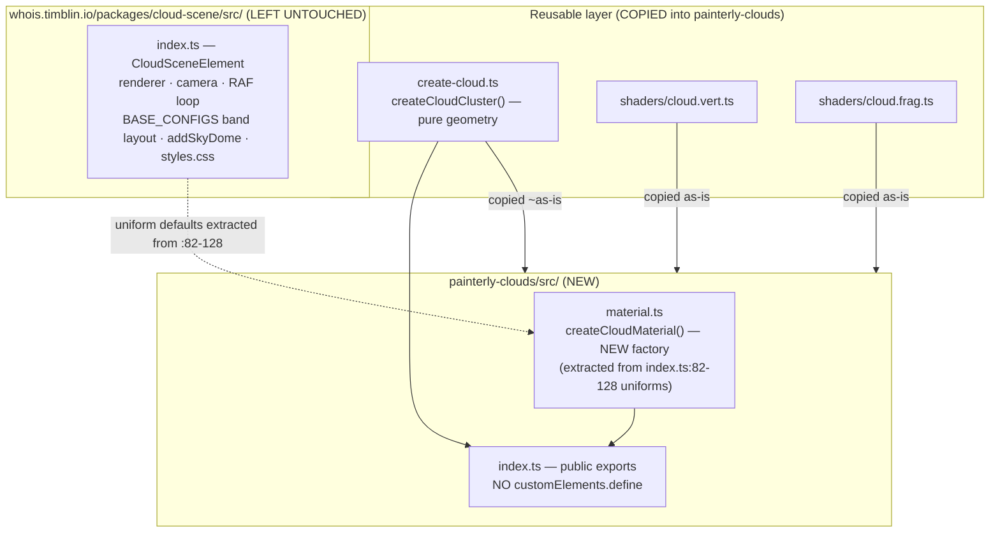

# feat: Extract `painterly-clouds` into a standalone shareable npm library

**Target repo:** `painterly-clouds` (a new, separate git repository). This plan
document lives in `whois.timblin.io/docs/plans/` because that is the planning home and
the source code currently lives here, but **all implementation file paths below are
relative to the new `painterly-clouds` repo root** unless explicitly prefixed with
`whois.timblin.io/`. Source files to copy out are cited with their current
`whois.timblin.io/packages/cloud-scene/` paths.

---

## Summary

Extract the reusable painterly-cloud primitives from `@whois/cloud-scene` into a new
standalone, publishable npm package, **`painterly-clouds`**, that ships two composable
Three.js factories — `createCloudCluster()` (instanced-sphere billow generator, already
decoupled) and `createCloudMaterial()` (the painterly toon `ShaderMaterial`, currently
inlined and **does not yet exist as a factory**). Consumers bring their own renderer,
camera, scene, and animation loop. The package ships built ESM+CJS with `.d.ts` types via
tsdown, declares `three` as a `>=0.160` peer dependency, includes a Vite + lil-gui demo
for GitHub Pages, a conversion-shaped README, and a minimal smoke-test suite.

This website's existing `<cloud-scene>` element is **left untouched** — migrating the site
to consume the published package is deferred follow-up work (see Scope Boundaries).

---

## Problem Frame

The painterly cloud look is good enough to share, but today it is fused into a
website-specific Web Component (`whois.timblin.io/packages/cloud-scene/src/index.ts`) that
owns a renderer, camera, RAF loop, sky dome, and a hero-tuned near/mid/far band layout.
The genuinely reusable parts — the billow generator and the toon shader — cannot be used
independently. The material's ~20 uniforms are hardcoded inline at `index.ts:82-128`;
there is no `createCloudMaterial()` seam. `three` is a hard `dependency`, which would
cause "Multiple instances of Three.js imported" errors for any consumer.

**Goal:** publish `painterly-clouds` so any Three.js developer can `npm install` it, add a
configurable painterly cloud to their own scene in <15 lines, and tune the look via
options + runtime uniforms — no shader editing.

---

## Requirements Traceability

Carried from origin (`docs/brainstorms/2026-06-21-extract-painterly-clouds-requirements.md`):

- **R1** — Expose `createCloudCluster()` returning a `THREE.Group`. → U2
- **R2** — Expose `createCloudMaterial(options)` returning the painterly `ShaderMaterial`
  with sensible defaults + overridable options (the core refactor). → U2
- **R3** — Full configuration surface (palette, light/edge, form, atmosphere, animation
  `time`, cluster shape) settable at creation and mutable at runtime via `material.uniforms`. → U2, U6
- **R4** — `three` as a `peerDependency` (`>=0.160.0`), not bundled. → U3, U1
- **R5** — Ship built ESM (+CJS) with `.d.ts` types, not raw `.ts`. → U3
- **R6** — License + npm package metadata (MIT, repository, keywords). → U1
- **R7** — Live demo page with controls (drag sliders, watch one cloud re-form). → U5, U7
- **R8** — Conversion-shaped README: above-the-fold visual, copy-paste example, options
  table. → U6
- **Success criteria** (origin §Success Criteria) — install-and-use in <15 lines (U4
  example proves it); no multi-instance Three.js warning (U3); look tunable by options
  alone (U2); demo + above-the-fold visual (U5–U7). This website still renders correctly
  — satisfied trivially by leaving it untouched (see Scope Boundaries).

---

## Key Technical Decisions

- **New standalone git repo** (user decision, resolves origin OQ1). Not a monorepo
  package. Implies dropping `"private": true` and adding `license`/`repository` metadata.
- **`three` as `peerDependencies: { "three": ">=0.160.0" }`**, with `three` +
  `@types/three` in `devDependencies`. Rationale: the entire three.js ecosystem
  (three-mesh-bvh `>=0.159`, drei `>=0.159`, troika `>=0.125`) uses open-ended `>=`, never
  a caret — three.js ships breaking changes in *minor* 0.x bumps, so `^0.170` would lock
  consumers to a single minor. `0.160` (Dec 2023) is a safe floor for the stable APIs used
  (`ShaderMaterial`, `InstancedMesh`, `Color`, `Vector3`). `three` must be `external` in
  the bundler so the consumer's single copy resolves — this is what prevents the
  multi-instance warning.
- **Build tool: tsdown** (Rolldown/Oxc-powered; tsup's actively-maintained 2026
  successor — tsup is now in maintenance mode). One pass emits ESM+CJS+`.d.ts`,
  externalizes peers automatically. Plain `tsc` is the fallback if tsdown proves fiddly.
- **Ship dual ESM+CJS.** Near-zero extra cost via tsdown; the package is pure factory
  functions (no module singleton state) so the dual-package hazard does not apply. ESM-only
  is defensible but dual maximizes adoption.
- **Shaders stay as TS template-literal strings** (`export const fragmentShader = ` ``
  ...glsl... `` `). They are just strings to the compiler — **no GLSL loader needed**, they
  inline into the bundle and emit as `declare const ... : string`. Keep the `/* glsl */`
  comment tag for editor highlighting.
- **Remove the module-level `customElements.define`** from the library entry so
  `sideEffects: false` holds and tree-shaking works. (The website keeps its own element;
  the library does not ship one — see Scope Boundaries.)
- **`createCloudMaterial()` accepts the same palette/edge/form/atmosphere options as
  overrides**; `createCloudCluster()` keeps `material` as an injectable param so one
  material can be shared across many clusters (the existing `layoutClouds` sharing pattern
  becomes the documented norm). Two-tier config: **options object for creation, `material.uniforms`
  for per-frame mutation** — the standard three.js idiom.
- **Add a `seed` option to `createCloudCluster`** so instanced layouts are deterministic
  (currently uses bare `Math.random()` at ~24 sites). Low-cost, high-value for reproducible
  demos/tests; use a tiny inline LCG (no new dependency). **The PRNG must replace every
  `Math.random()` site — both billow placement AND the per-instance `aBrushSeed` fill
  (`create-cloud.ts:273-275`), preserving draw order** — otherwise two `seed:42` calls
  produce identical instance matrices but different surface brush noise (deterministic by
  matrix, still varying visually).
- **Fog uses view-space depth, not world-Z** (resolves origin OQ4; raised by review). The
  source fogs on `abs(cameraPosition.z - vWorldPosition.z)` (`cloud.frag.ts:188`) with
  defaults (`uFogNear` 58 / `uFogFar` 86) calibrated to this site's z=42 camera and
  160-unit frustum — so a consumer with a differently-placed/scaled camera gets a wrong
  look *out of the box* (fully fogged flat blob, or never fogged). For a library embedded in
  arbitrary scenes, switch the depth term to standard view-space depth (`-mvPosition.z`,
  orientation-independent, ~1 line) AND ship fog effectively off by default (large `uFogFar`)
  so the default render is scene-agnostic. Documenting the assumption is not enough when the
  *default* renders wrong.
- **Demo uses Vite + lil-gui** (the official dat.gui successor; three.js's own examples
  migrated to it), GUI bound directly to `material.uniforms`, deployed to GitHub Pages.
- **Minimal smoke tests only** (user decision). The source repo has zero test infra; a
  full suite is disproportionate. Test what is feasible headlessly (geometry/factory logic,
  exports, attribute wiring) — shader visual output is verified via the demo, not assertions.
  (Confirmed feasible: `createCloudCluster` uses only CPU-side three.js constructors and
  needs no WebGL context.)
- **The runtime uniform surface is a SemVer-load-bearing public API** (raised by review).
  Documenting `material.uniforms.uFogFar` etc. as the runtime-mutation API welds the
  internal GLSL identifier names into the package's compatibility contract — renaming a
  uniform or refactoring an effect becomes a breaking change. **Decision:** accept this as
  an explicit stability tier — the `u*` uniform names are public API and follow SemVer;
  state that contract in the README uniforms table. (A friendly-name setter layer that
  insulates the GLSL is deferred follow-up; not worth the indirection for v0.) This must be
  decided before publish — reversing after consumers write `material.uniforms.uFogFar.value`
  is a major bump.
- **CJS is genuinely optional** (raised by review; origin asked only for ESM+types). Dual
  ESM+CJS stays the target because tsdown makes it near-free, but if tsdown's dual/dts emit
  proves fiddly, the fallback is **ESM-only via `tsc`** (drop the `require` condition from
  `exports`), NOT a hand-rolled dual `tsc` setup. The Three.js consumer base is almost
  entirely ESM, so ESM-only is a safe one-step retreat.

---

## High-Level Technical Design

### Extraction boundary — what moves, what stays



### Public API shape

```
createCloudMaterial(options?) -> THREE.ShaderMaterial
  options: { colorHighlight, colorMid, colorShadow, colorDeep, colorAccent,
             lightDir, edgeColor, edgeStrength, edgeFalloff,
             displacementStrength, noiseScale, bandSoftness, formNoise, weldAmount,
             fogColor, fogNear, fogFar }   // all optional, sensible defaults

createCloudCluster(options?) -> THREE.Group
  options: { sphereCount?, spread?:{x,y,z}, baseScale?, flatten?, edgeSoft?,
             material?, seed? }            // material defaults to createCloudMaterial()

// runtime (consumer's own loop):  material.uniforms.uTime.value = elapsed
//   note: `time` is runtime-only (the uTime uniform) — NOT a createCloudMaterial option
```

Directional only — exact option names/defaults finalized during U2.

---

## Output Structure

Expected layout of the new `painterly-clouds` repo:

```
painterly-clouds/
├── src/
│   ├── index.ts              # public exports (no side effects)
│   ├── material.ts           # createCloudMaterial() — NEW
│   ├── create-cloud.ts       # createCloudCluster() — copied from cloud-scene
│   └── shaders/
│       ├── cloud.vert.ts     # copied as-is
│       └── cloud.frag.ts     # copied as-is
├── demo/
│   ├── index.html
│   └── main.ts               # scene + RAF + lil-gui bound to uniforms
├── test/
│   └── *.test.ts             # smoke tests (factory/geometry/exports)
├── package.json
├── tsdown.config.ts
├── tsconfig.json
├── vite.config.ts            # demo build (base path for GH Pages)
├── .github/workflows/        # deploy demo to Pages (optional, U7)
├── README.md
└── LICENSE
```

Authoritative for shape, not a constraint — per-unit `**Files:**` govern what each unit creates.

---

## Implementation Units

### U1. Scaffold the new `painterly-clouds` repo and package manifest

**Goal:** Stand up the empty repo with a publishable, modern-ESM `package.json` and TS
config — no cloud code yet.
**Requirements:** R4, R6.
**Dependencies:** none.
**Files:** `package.json`, `tsconfig.json`, `LICENSE`, `.gitignore`, `README.md` (stub).
**Approach:**
- `package.json`: `name: painterly-clouds`, `version: 0.1.0`, `type: module`,
  `license: MIT`, `sideEffects: false`, `files: ["dist"]`, rich `keywords`
  (`three`, `threejs`, `three-js`, `webgl`, `glsl`, `clouds`, `painterly`, `stylized` —
  avoid `volumetric`/`raymarched`, inaccurate for this instanced-sphere technique),
  `repository`/`homepage`/`bugs`, `engines: { node: ">=18" }`.
- `exports` map with `types` listed **first** in each condition, `import`→`./dist/index.js`,
  `require`→`./dist/index.cjs`; legacy `main`/`module`/`types` top-level fallbacks; export
  `./package.json`.
- `peerDependencies: { three: ">=0.160.0" }`; `devDependencies`: `three ^0.170`,
  `@types/three ^0.170`, `tsdown`, `typescript`, `vite`, `lil-gui`, `vitest` (test runner — see U4).
- `tsconfig.json`: mirror the source repo's `moduleResolution: "bundler"`, `strict`,
  `skipLibCheck: true`; tabs for indentation (repo convention).
- `LICENSE`: MIT, author Tristan Timblin.
**Patterns to follow:** the manifest field set researched from three-mesh-bvh / drei /
meshline (see KTDs). Indentation = tabs, matching `whois.timblin.io/packages/*`.
**Test scenarios:** `Test expectation: none -- scaffolding/config only, no behavior. Validated by U3 build succeeding.`
**Verification:** `npm install` resolves; `tsc --noEmit` passes on the empty/stub entry.

---

### U2. Extract `createCloudMaterial()` and copy the reusable cloud layer

**Goal:** Create the missing material factory and bring over the cluster generator +
shaders, wiring them into a clean public entry point.
**Requirements:** R1, R2, R3.
**Dependencies:** U1.
**Files (new repo):** `src/material.ts` (new), `src/create-cloud.ts` (copied), `src/shaders/cloud.vert.ts`
(copied), `src/shaders/cloud.frag.ts` (copied), `src/index.ts` (new public exports).
**Source to copy from:** `whois.timblin.io/packages/cloud-scene/src/create-cloud.ts`,
`.../shaders/cloud.vert.ts`, `.../shaders/cloud.frag.ts`; material uniform defaults from
`.../index.ts:82-128`.
**Approach:**
- `material.ts`: lift the `new ShaderMaterial({...})` block from `index.ts:82-128` into
  `createCloudMaterial(options?)`. Map every option to its uniform; keep the current inline
  values as defaults so the look is unchanged. Group options logically but keep the object
  flat (palette colors, light/edge, form, atmosphere). Accept `Color`/hex and `Vector3`
  conveniently for color/dir options.
- `create-cloud.ts`: copy, then make two **interface changes** (not a verbatim copy):
  (a) `material` moves from required → optional, defaulting to `createCloudMaterial()` when
  omitted; (b) `sphereCount`/`spread`/`baseScale` move from required → optional-with-defaults
  (the website always passed them explicitly, so no defaults exist in source — pick a default
  `sphereCount` whose LOD-bucket split is predictable so the structural test is stable). Then
  add the `seed` option, routing **all** `Math.random()` sites (placement + the `aBrushSeed`
  fill at `:273-275` + the `addPlacement` `round` jitter at `:56`) through the seeded LCG,
  preserving draw order. Default (no seed) keeps current random behavior.
- `index.ts`: re-export `createCloudCluster`, `createCloudMaterial`, their option types,
  and (optionally) the raw shader strings + `ClusterParams`/option interfaces. **No
  `customElements.define`, no module-level side effects.**
**Patterns to follow:** existing `ClusterParams` interface and DI-of-material pattern in
`create-cloud.ts`; named `three` imports (`import { Group } from "three"`), never deep paths.
**Test scenarios:**
- `createCloudMaterial()` with no args returns a `ShaderMaterial` whose uniform values
  equal the current `index.ts:82-128` defaults (guards against drift during extraction).
  Note: `uLightDir`'s default is the **normalized** vector (`new Vector3(-0.3,0.55,-0.5).normalize()`
  ≈ `(-0.376, 0.690, -0.627)`) — assert with float tolerance, and confirm the factory
  normalizes a user-supplied `lightDir` too (matching current behavior).
- `createCloudMaterial({ edgeStrength: 0.9, fogNear: 30 })` overrides only those uniforms;
  all others retain defaults.
- Color option accepts both a hex number and a `THREE.Color`; both land as a `Color` uniform.
- `createCloudCluster()` with no args returns a `Group` containing 1–2 `InstancedMesh`
  children (LOD buckets — a bucket is omitted when empty), each carrying the four instanced
  attributes (`aBrushSeed`, `aCloudHeight`, `aClusterCentroid`, `aEdgeSoft`).
- `createCloudCluster({ seed: 42 })` produces identical instance matrices **and identical
  `aBrushSeed`/`aCloudHeight`/`aClusterCentroid` attribute arrays** across two calls (so the
  reproducibility is visual, not just positional); differing seeds differ.
- `createCloudCluster()` with no `material` auto-creates one via `createCloudMaterial()`.
- Edge: `sphereCount` small (e.g. 8) still produces a valid non-empty group (primary-count
  floor logic holds).
**Verification:** importing `src/index.ts` in a Node/Vitest context constructs a cluster
without a WebGL context (geometry generation is renderer-independent); uniform-default test
passes.

---

### U3. Add the tsdown build and verify the published artifact

**Goal:** Produce built ESM+CJS+`.d.ts` output with `three` externalized.
**Requirements:** R4, R5.
**Dependencies:** U2.
**Files:** `tsdown.config.ts`, `package.json` (add `build`/`dev`/`prepublishOnly` scripts).
**Approach:**
- `tsdown.config.ts`: `entry: ["src/index.ts"]`, `format: ["esm","cjs"]`, `dts: true`,
  `clean: true`, `external: ["three"]`, `target: "es2022"`.
- Add `scripts.build = "tsdown"`, `dev = "tsdown --watch"`, `prepublishOnly = "npm run build"`.
- Confirm `dist/` contains `index.js`, `index.cjs`, `index.d.ts`; confirm `three` does NOT
  appear bundled (bare `from "three"` imports survive in output).
**Patterns to follow:** the researched tsdown config (KTDs). Fallback to `tsc` emit if dts
generation misbehaves.
**Test scenarios:**
- Build smoke test: after `npm run build`, `dist/index.js`, `dist/index.cjs`, and
  `dist/index.d.ts` all exist.
- Grep assertion: built output contains `from "three"` (externalized), not an inlined three
  module.
- `npm pack --dry-run` includes only `dist/`, `package.json`, `README.md`, `LICENSE`.
- `.d.ts` exposes `createCloudCluster`, `createCloudMaterial`, and option types.
**Verification:** a scratch consumer project that imports the built package and a separate
`three` shows no "Multiple instances of Three.js imported" warning at runtime.

---

### U4. Minimal smoke-test suite + headless verification

**Goal:** Lock in the U2/U3 behaviors with an actual runnable test runner (the repo's first).
**Requirements:** Success criteria (install-and-use, determinism, defaults stability).
**Dependencies:** U2 (logic), U3 (build smoke).
**Files:** `test/material.test.ts`, `test/create-cloud.test.ts`, `test/build.test.ts`,
`package.json` (`scripts.test`), test-runner config if needed.
**Approach:** use **Vitest** (Vite-native, aligns with the demo's Vite toolchain, no extra
ecosystem). Cover the U2/U3 scenarios above. Geometry/factory tests need no WebGL context;
do not attempt to assert rendered pixels. Build test shells out to the build then checks
`dist/` artifacts.
**Execution note:** write the uniform-defaults test first — it is the regression guard that
the extraction did not change the look.
**Test scenarios:** (the consolidated U2 + U3 scenarios above — material defaults/overrides,
color coercion, cluster structure + attributes, seed determinism, auto-material, small
`sphereCount`, and the three build-artifact checks).
**Verification:** `npm test` green; CI-less local run is sufficient given repo posture.

---

### U5. Build the interactive demo (Vite + lil-gui)

**Goal:** A live page showing one painterly cloud with sliders that re-form/recolor it in
real time — the package's primary marketing surface.
**Requirements:** R7.
**Dependencies:** U2.
**Files:** `demo/index.html`, `demo/main.ts`, `vite.config.ts`, `package.json` (`scripts.demo`).
**Approach:**
- `demo/main.ts`: minimal consumer-style boilerplate — `WebGLRenderer`, `PerspectiveCamera`,
  `Scene`, a single `createCloudCluster()` added to the scene, and a RAF loop advancing
  `material.uniforms.uTime.value`. This doubles as the canonical copy-paste example for U6.
- A `lil-gui` panel bound directly to `material.uniforms` (displacement, edge glow, band
  softness, weld, fog near/far) and `addColor` controls for the palette uniforms; optionally
  a `sphereCount`/`seed` control that rebuilds the cluster.
- `vite.config.ts`: set `base` for GitHub Pages project-path hosting.
- Include a subtle gradient backdrop in the demo (a clear-color or simple gradient) so the
  cloud reads against something — demonstrating that the package itself ships no sky (origin
  scope) while still looking finished.
**Patterns to follow:** the renderer/camera/RAF setup mirrors (but slims down)
`whois.timblin.io/packages/cloud-scene/src/index.ts` lifecycle; uniform-mutation pattern
from `index.ts:379`.
**Test scenarios:** `Test expectation: none -- visual demo, verified by running it and by the U6 README GIF capture. No automated assertions on rendered output.`
**Verification:** `npm run demo` serves a page; dragging sliders visibly changes the cloud;
the cloud animates (drifts/boils) via `uTime`.

---

### U6. Write the conversion-shaped README

**Goal:** A README that sells the look and gets a developer to working code fast.
**Requirements:** R3, R8.
**Dependencies:** U2 (API names final), U5 (example + visual source).
**Files:** `README.md`.
**Approach:** structure for conversion (researched ordering):
1. Looping video/GIF (or `<video>`) at the very top, linked to the live demo.
2. One-line description + `npm i painterly-clouds three` (always show `three` — it's a peer).
3. Shortest runnable copy-paste example (the U5 boilerplate trimmed) — renderer, scene,
   camera, `createCloudCluster`, loop advancing `uTime`. Proves the <15-line success
   criterion. Frame the promise as "a painterly cloud," not "the hero look" (the hero
   composition needs the non-shipped band layout + specific camera — see Risks).
4. **Options table** for `createCloudMaterial` and `createCloudCluster` (option, type,
   default, description) generated from the U2 interfaces.
5. **Uniforms table** documenting the runtime-mutable `material.uniforms.*` surface (the
   ~20 uniforms are effectively public API and are undiscoverable without docs).
6. Live-demo link + optional "Edit on StackBlitz" badge; npm/license badges.
**Patterns to follow:** the per-package README style in
`whois.timblin.io/packages/sticky-heading/README.md` for tone, expanded for a public lib.
**Test scenarios:** `Test expectation: none -- documentation. Verify the copy-paste example actually runs (manually paste into the demo scaffold).`
**Verification:** a stranger understands what the package is from the first screen; the
copy-paste example runs unmodified.

---

### U7. GitHub Pages deploy workflow for the demo

**Goal:** Host the demo so `homepage`/README links resolve to a live page. The origin treats
a *live* demo as part of the deliverable, not optional polish — so the hosting half of R7 is
required, **gated only on the repo being public and pushed**. If the repo is not yet public
at implementation time, this unit is explicitly deferred (see Scope Boundaries) rather than
silently skipped — U1–U6 must not be called "done" while a live demo link is promised but
absent.
**Requirements:** R7 (hosting half).
**Dependencies:** U5.
**Files:** `.github/workflows/deploy-demo.yml`.
**Approach:** GitHub Action that builds the Vite demo and publishes to Pages on push to the
default branch. Set the package `homepage` to the Pages URL. (Vercel/Netlify are acceptable
substitutes.)
**Test scenarios:** `Test expectation: none -- CI config. Verified by the Action succeeding and the Pages URL loading.`
**Verification:** pushing to the default branch publishes a working demo at the Pages URL.

---

## Scope Boundaries

### In scope
- New `painterly-clouds` repo: the two primitives, build, peer-dep, tests-where-feasible, demo, README.

### Deferred to Follow-Up Work
- **Migrating this website (`whois.timblin.io`) to consume the published package** (user
  decision: "migrate later when stable"). The existing `@whois/cloud-scene` element stays
  exactly as-is for now; it keeps working unchanged. Once `painterly-clouds` is published
  and stable, a separate effort rewires `cloud-scene` into a thin wrapper that imports the
  package and retains only the website-specific `BASE_CONFIGS`, `addSkyDome`, tiling loop,
  and `styles.css`.
- **`./element` subpath** shipping an optional `<cloud-scene>`-style custom element as a
  batteries-included convenience — only if demand appears.
- **Publishing to npm** itself (the `npm publish` step) — the plan produces a
  publish-*ready* package; actually publishing is a follow-up gate.
- **U7 demo hosting** is deferred *only if* the repo is not public/pushed at implementation
  time. When the repo is public, U7 is required (the live demo is part of R7's deliverable).

### Outside this package's identity (from origin)
- The `<cloud-scene>` Web Component (owns renderer + loop — contradicts "your own scene").
- The near/mid/far **band layout** (`BASE_CONFIGS`) — a website composition, shown only as
  a demo/README example, never shipped API.
- The gradient **sky dome** — the consumer's backdrop concern; the demo includes a simple
  backdrop but the package ships none.
- The drift/bob/**tiling loop** — one line of README guidance, not shipped code.
- **Models / texture assets** — none exist; "zero assets, fully procedural" is a selling point.

---

## Risks & Dependencies

- **Look drift during material extraction.** Moving ~20 uniforms from inline to a factory
  risks a changed default value silently altering the material. *Mitigation:* the U2/U4
  uniform-defaults regression test pins every default to the current `index.ts:82-128` value;
  written first (U4 execution note). **Scope note:** this test proves *material-default
  fidelity* only — it does NOT prove "the hero look is reproduced." The website's hero look
  is jointly produced by the material + the non-shipped `BASE_CONFIGS` band layout + the
  z=42 camera + per-band `edgeSoft`/`flatten`/fog tuned to those distances. A consumer
  calling `createCloudCluster()` with an arbitrary camera gets *a* painterly cloud, not the
  hero composition. The README and demo must promise "a painterly cloud," not "the hero
  look," and the U5 demo ships the specific camera + cluster params that produce a
  representative result so the copy-paste example is self-consistent.
- **Sky-derived color defaults are not neutral.** `uFogColor` (`0xcfe4f5`) and `uEdgeColor`
  (`0xe8eef8`) are pale-blue, derived from this site's sky horizon — a consumer on a dark or
  non-blue backdrop sees silhouettes melt to pale-blue haze (looks broken, not unstyled).
  *Mitigation:* the README options table flags these as "set to match your backdrop," not
  neutral defaults; the U5 demo backdrop uses the sky-horizon color the defaults assume so
  the demo is honest about what produces the look. (Combined with the view-space-fog +
  fog-off-by-default KTD, the out-of-box render stays scene-agnostic.)
- **Camera-coupling in the fog term** (origin OQ4): `cloud.frag.ts:188` fogs on
  `abs(cameraPosition.z - vWorldPosition.z)`, assuming a camera looking down −Z. *Mitigation:*
  document this assumption in the README uniforms section rather than generalize now; the
  demo camera satisfies it. Revisit only if consumers report issues.
- **tsdown maturity.** Newer than tsup; if `.d.ts` emission or externalization misbehaves,
  fall back to `tsc` emit (KTD fallback already noted).
- **First test/build infra in the author's toolchain.** No existing precedent to copy in the
  source repo; the new repo establishes its own. Kept minimal (Vitest + tsdown) to limit
  ceremony.
- **`@types/three` drift** across the wide peer range. *Mitigation:* `skipLibCheck: true`
  absorbs minor type drift consumer-side; devDeps pin a concrete `three`/`@types/three` for
  the build.

---

## Sources & Research

- **Repo research** (`whois.timblin.io`): confirmed no build pipeline, no test/lint tooling,
  no `engines`, all packages ship raw `.ts` and are `private: true`; `create-cloud.ts` is
  already renderer-decoupled and takes an injected material; the material is inlined at
  `index.ts:82-128`; `three ^0.170.0` is a hard dependency; `<cloud-scene>` used once in
  `whois.timblin.io/src/pages/index.astro`.
- **Best-practices research** (load-bearing — shaped the peer-dep range, build tool, and
  package fields KTDs): three.js ecosystem uses `three` peer `>=` not caret (three-mesh-bvh
  `>=0.159`, drei `>=0.159`, troika `>=0.125`, maath, meshline); tsup → **tsdown** is the
  maintained 2026 successor; dual ESM+CJS safe for stateless factories; GLSL-as-strings
  needs no loader; `sideEffects: false` requires removing module-level `customElements.define`;
  lil-gui is the dat.gui successor; `exports` map with `types`-first; README conversion ordering.
- **Learnings:** no `docs/solutions/` store exists in the source repo — greenfield, no prior
  constraints. Worth running `/ce-compound` after landing to capture the bundler choice and
  the material-factory split.
- **Origin requirements:** `docs/brainstorms/2026-06-21-extract-painterly-clouds-requirements.md`.
